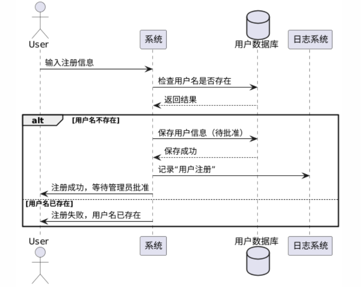
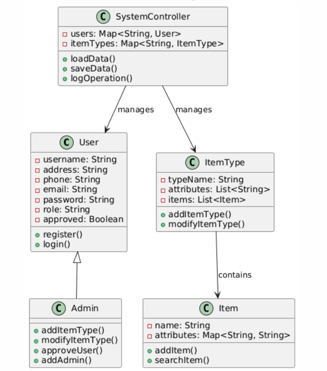

物品管理系统
介绍
这是一个基于 Python 的物品管理系统，用于记录和管理物品信息。用户可以通过该系统进行物品的增、删、查、改等操作，同时程序会将每次操作记录到日志文件中，方便追溯和调试。系统的数据保存在 JSON 文件中，以确保数据的持久性。系统支持不同用户角色（管理员和普通用户），并基于角色进行权限控制，增强系统的安全性和管理效率。

功能
用户功能（普通用户）
注册用户：普通用户可以注册账户，注册后需等待管理员批准。
用户登录：已批准的用户可以登录系统。
添加物品：添加物品的名称、描述和联系人信息。
删除物品：删除物品。
修改物品：修改已存在物品的描述或联系人信息。
查找物品：根据物品名称查找物品信息。
显示物品列表：显示所有当前物品的信息。
退出系统：安全退出系统。
管理员功能
管理员登录：管理员可以登录系统，拥有更高的权限。
添加物品类型：添加新的物品类型（例如“电子产品”、“家具”等）。
修改物品类型：修改现有的物品类型。
批准用户：批准普通用户的注册请求。
添加管理员：添加新的管理员账户。
管理物品：执行普通用户的所有物品管理操作。
退出系统：安全退出系统。
公共功能
加载数据：启动时加载存储在 items_data.json 和 users_data.json 文件中的物品和用户数据。
保存数据：退出时保存所有更改到数据文件中。
日志记录：所有操作都会记录到 operation_log.txt 文件中，包括操作类型和相关详情。
环境要求
Python 3.x
依赖库：
getpass（用于隐藏密码输入）
json（用于处理 JSON 数据）
logging（用于日志记录）
文件系统访问权限：需要读写数据文件和日志文件的权限。
文件结构

物品管理系统/
│
├── items_data.json          # 存储物品数据的 JSON 文件
├── users_data.json          # 存储用户数据的 JSON 文件
├── operation_log.txt        # 操作日志文件
├── hw_item_resurrection.py  # 主程序代码
├── generate_data.py         # 数据生成脚本（可选）
└── README.md                # 项目说明文件
使用方法
：

一、运行主程序文件：

python hw_item_resurrection.py
操作流程
程序启动后，用户会看到以下操作菜单：
未登录状态

请选择操作:
1. 注册用户
2. 登录
3. 退出
注册用户
输入用户名、地址、电话、邮箱和密码。
系统会将用户信息保存到 users_data.json，并标记为待批准。
操作记录将保存到 operation_log.txt。
登录
二、输入用户名和密码。
根据用户角色（管理员或普通用户）展示相应的菜单。
普通用户菜单

请选择操作:
1. 添加物品
2. 删除物品
3. 显示物品列表
4. 查找物品
5. 修改物品信息
6. 退出
添加物品：输入物品名称、描述和联系人信息，系统将会把物品添加到数据中，并保存到文件。
删除物品：输入物品名称，系统将删除指定的物品。
显示物品列表：系统将列出所有物品的名称、描述和联系人信息。
查找物品：输入物品名称，系统将查找并显示物品信息。
修改物品信息：输入物品名称，选择修改描述或联系人信息。
退出：退出程序，并保存所有更改。
管理员菜单

请选择操作:
1. 添加物品类型
2. 修改物品类型
3. 批准用户
4. 添加管理员
5. 管理物品
6. 退出
添加物品类型：输入新的物品类型名称，系统将添加到 items_data.json。
修改物品类型：输入现有物品类型名称，修改其属性。
批准用户：查看待批准的用户列表，批准或拒绝用户注册请求。
添加管理员：添加新的管理员账户，需输入必要的用户信息。
管理物品：执行普通用户的所有物品管理操作。
退出：退出程序，并保存所有更改。

三、日志记录
所有操作都会记录到 operation_log.txt 文件中。每次操作记录会包含时间戳、操作类型和详情。例如：

2025-01-05 09:00:00,000 - INFO - 操作: 注册用户, 详情: 用户 'jane_doe' 注册成功，等待管理员批准
2025-01-05 09:05:00,000 - INFO - 操作: 登录, 详情: 用户 'admin' 登录成功
2025-01-05 09:10:00,000 - INFO - 操作: 添加物品类型, 详情: 物品类型 '电子产品' 添加成功
2025-01-05 09:15:00,000 - INFO - 操作: 批准用户, 详情: 用户 'jane_doe' 被批准
2025-01-05 09:20:00,000 - INFO - 操作: 添加物品, 详情: 物品 '笔记本电脑' 添加成功
2025-01-05 09:25:00,000 - INFO - 操作: 修改物品, 详情: 物品 '笔记本电脑' 描述已修改为：Dell XPS 13
2025-01-05 09:30:00,000 - INFO - 操作: 删除物品, 详情: 物品 '旧手机' 已删除
2025-01-05 09:35:00,000 - INFO - 操作: 添加管理员, 详情: 管理员 'new_admin' 添加成功

